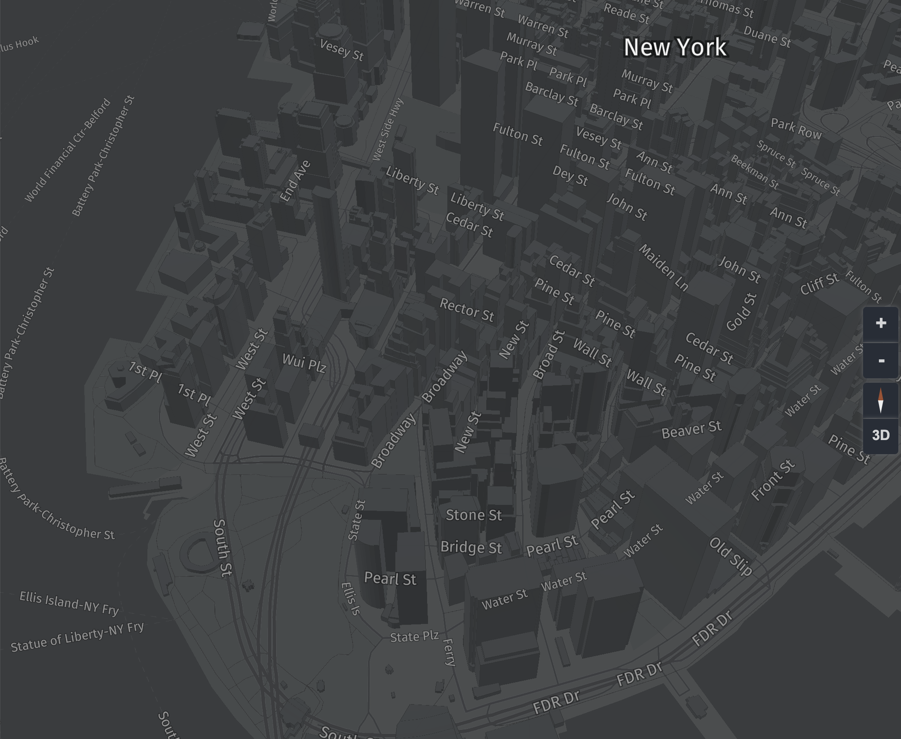

# Getting started with harp.gl
Short story is that harp.gl helps you make maps - really pretty custom ones that'll make everyone go "ooo".

## What are we going to make today?
We'll make a basic map that you can zoom in/out - nothing fancy. But you gotta get started somewhere.



### Step 1
Create a new folder:
```
mkdir harpgl-demo
cd harpgl-demo
```
Create your html file:
```
touch index.html
```
and here's what you're going to paste in your html file:
```
<html>
    <head>
        <style>
            body,
            html {
                border: 0;
                margin: 0;
                padding: 0;
            }
            #map {
                height: 100vh;
                width: 100vw;
            }
        </style>
        <script src="https://unpkg.com/three/build/three.min.js"></script>
        <script src="https://unpkg.com/@here/harp.gl/dist/harp.js"></script>
    </head>
    <body>
        <canvas id="map"></canvas>
        <script src="index.js"></script>
    </body>
</html>
```

And in your main.js file:
```
const canvas = document.getElementById('map');
const map = new harp.MapView({
   canvas,
   theme: "https://unpkg.com/@here/harp-map-theme@latest/resources/berlin_tilezen_night_reduced.json"
});

// center the camera to New York
map.lookAt({
  target: new harp.GeoCoordinates(40.70398928, -74.01319808),
  zoomLevel: 16,
  tilt: 40,
});

const mapControls = new harp.MapControls(map);
const ui = new harp.MapControlsUI(mapControls);
canvas.parentElement.appendChild(ui.domElement);

map.resize(window.innerWidth, window.innerHeight);
window.onresize = () => map.resize(window.innerWidth, window.innerHeight);

// omv standad for Optimized Map for Visualization
const omvDataSource = new harp.VectorTileDataSource({
   authenticationCode: "API_KEY",
});

map.addDataSource(omvDataSource);
```

### Step 2: Get your API Key (it's free, takes 2 minutes tops)

Create a [HERE account](developer.here.com), go to your projects and create a REST API. Copy the API KEY, that's what you'll need. 

You'll want to stick your API KEY in your `main.js` file where it says API_KEY. That should get you set up!

If you are trying this step but something isn't working, you may be accidentally putting your APP ID instead of the API KEY, so double check that part!


### Step 3:
Okay we're almost there! 

If Python version returned above is 3.X:
```
python3 -m http.server
```

If Python version returned above is 2.X:
```
python -m SimpleHTTPServer
```

Note: On windows try "python" instead of "python3", or "py -3"

And now if you go to your localhost, you should be able to see New York!

### License

Distributed under the GNU v3 license. See `LICENSE` for more information.


### Contact

Sayna Parsi - [@sainaparsi](https://twitter.com/sainaparsi)